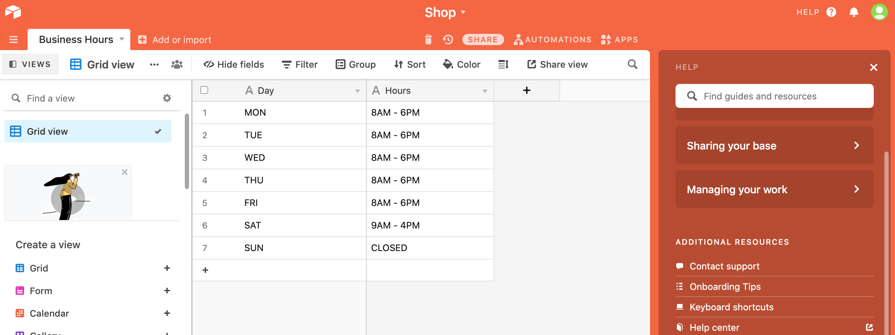
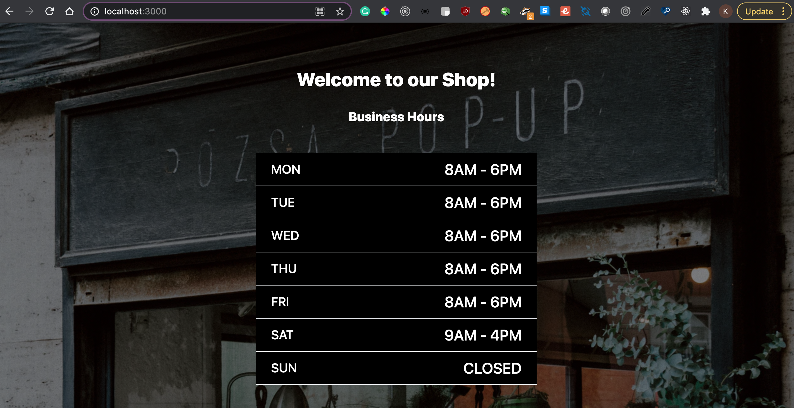

# A shop business hours website powered by Airtable

## Introduction

In this project, I created a simple website that gets opening hours from an Airtable API, and displays them in a nice UI.

This was my first time using Airtable and found that it is such a great tool. It allows us to create a database "in the cloud" in a very easy and accessible way. 

It is intuitive so non-coders are able to update the opening hours, and they'll be displayed on the shop website. 

Airtable serves as a database, the source of our data.

## Process

First, I signed up to Airtable, and created a new base.

I called my base Shop, I named the table Business Hours and I made 2 columns: Day and Hours, adding the days of the week and for each day the opening hours:

I used a Node.js server to create a page server-side using Pug. 

## Technologies

  * Pug
  * Tailwind
  * Node
  * Express
  * Airtable API

